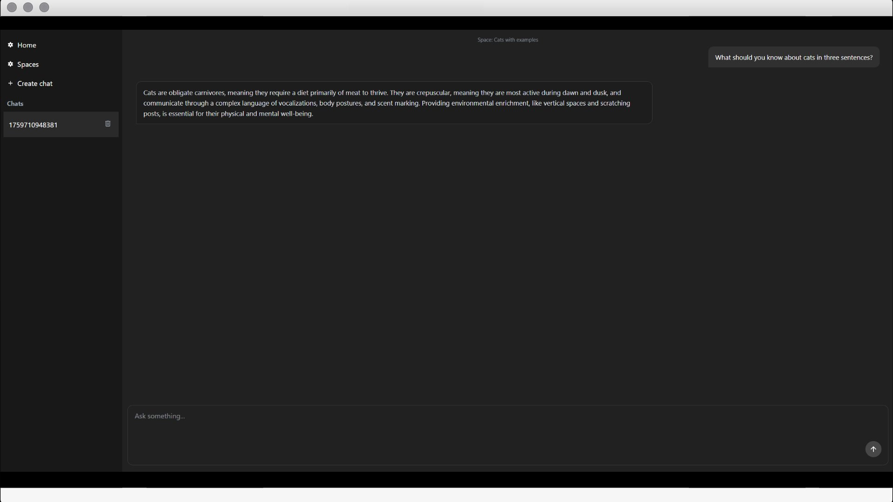
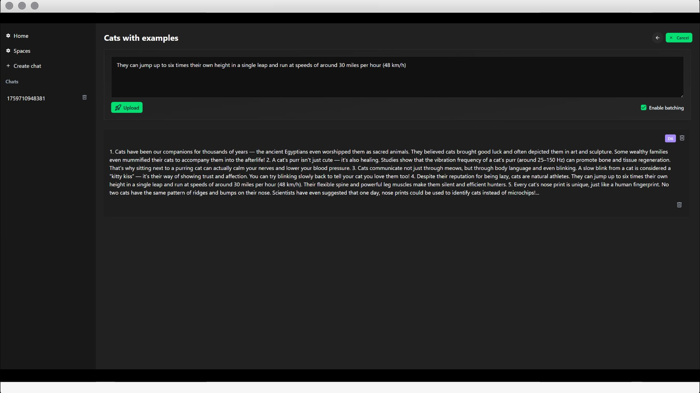

## Spring AI RAG Agent UI

<p align="left">
  <a href="https://github.com/AdmiralXy/spring-ai-rag-agent">
    
  </a>
  <a href="https://github.com/AdmiralXy/spring-ai-rag-agent-ui">
    
  </a>
  <a href="https://github.com/AdmiralXy/spring-ai-rag-agent-docker">
    
  </a>
</p>


<br/><br/>


## Setup

Make sure to install dependencies:

```bash
# npm
npm install

# pnpm
pnpm install

# yarn
yarn install

# bun
bun install
```

## Development Server

Start the development server on `http://localhost:3000`:

```bash
# npm
npm run dev

# pnpm
pnpm dev

# yarn
yarn dev

# bun
bun run dev
```

## Production

Build the application for production:

```bash
# npm
npm run build

# pnpm
pnpm build

# yarn
yarn build

# bun
bun run build
```

Locally preview production build:

```bash
# npm
npm run preview

# pnpm
pnpm preview

# yarn
yarn preview

# bun
bun run preview
```

Check out the [deployment documentation](https://nuxt.com/docs/getting-started/deployment) for more information.
